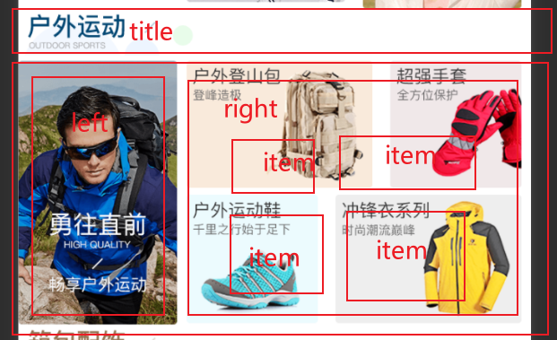
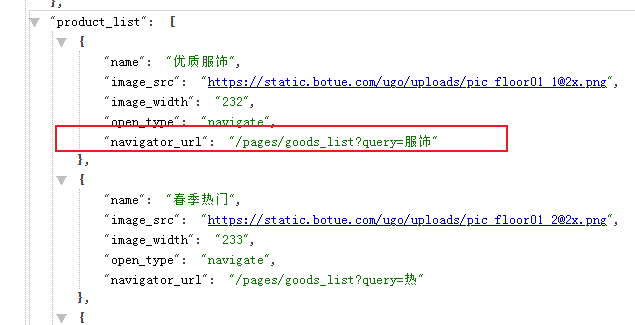
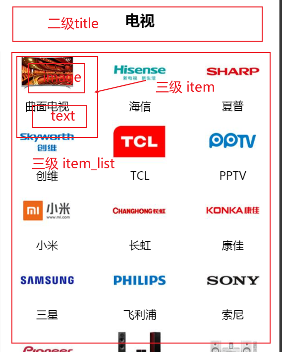

# 项目日志

# 0. isssue

1. 使用hubuilderx 开发小程序 ，小程序的自动热重载不生效(不能自动更新)：

   关闭小程序的设置 `修改文件自动保存`

2. 


# 1. 项目搭建

## 1.1 uniapp的项目结构

```text
┌─components            uni-app组件目录
│  └─comp-a.vue         可复用的a组件
├─pages                 业务页面文件存放的目录
│  ├─index
│  │  └─index.vue       index页面
│  └─list
│     └─list.vue        list页面
├─static                存放应用引用静态资源（如图片、视频等）的目录，注意：静态资源只能存放于此
├─main.js               Vue初始化入口文件
├─App.vue               应用配置，用来配置小程序的全局样式、生命周期函数等
├─manifest.json         配置应用名称、appid、logo、版本等打包信息
└─pages.json            配置页面路径、页面窗口样式、tabBar、navigationBar 等页面类信息
```


## 1.2 git管理

手动创建`.gitignore` 文件

```text
/node_modules
/unpackage/dist
```

由于`unpackage`下只有一个`dist`文件夹(用于生成编译好的小程序文件)，被忽略后就不会被git追踪了。

要避免这样，就在`unpackage`下新建一个`.gitkeep`文件，它无实意，只是让git能继续跟踪


# 2. tabBar

没啥注意的，就是在pages中添加每个tabbar路径，

在tabbar项的list中配置每一个tabbar参数而已


# 3. 首页

## 3.1 引入网络请求的包

因为小程序不支持 axios

```js
import {
    $http
} from '@escook/request-miniprogram'

// 在 uni-app 项目中，可以把 $http 挂载到 uni 顶级对象之上，方便全局调用
uni.$http = $http
```


配置基本请求地址：

```js
//配置基本url
$http.baseUrl = 'https://api-ugo-web.itheima.net'
```


并且可以配置拦截器：

```js
//请求拦截器
$http.beforeRequest = function(options) {
    wx.showLoading('加载中...')
}

//响应拦截器
$http.afterRequest = function(options) {
    wx.hideLoading()
}
```


## 3.2 轮播图

在页面加载时发送网络请求

```js
onLoad() {
    //页面加载发送轮播图请求
    this.getSwiperList()
},
    methods: {
        //轮播图请求
        async getSwiperList() {
            const {
                data: res
            } = await uni.$http.get('/api/public/v1/home/swiperdata')
            if (res.meta.status !== 200) {
                return wx.showToast({
                    title: '获取数据失败',
                    duration: 1500,
                    icon: 'error'
                })
            } else {
                this.swiperList = res.message
                console.log(this.swiperList);
            }

        }
    }
```

渲染到页面

```html
<view>
    <swiper :indicator-dots="true" :autoplay="true" :interval="3000" :duration="1000">
        <swiper-item v-for=" (item,index) in  swiperList" :key="index">
            <view class="swiper-item">
                <image :src="item.image_src"></image>
            </view>
        </swiper-item>
    </swiper>
</view>
```


### 3.2.1 创建轮播图的详情分包

```json

"subPackages": [{
    "root": "subpck",
    "pages": [{
        "path": "goods_detail/goods_detail",
        "style": {
        }
    }]
}],
```


### 3.2.2 点击轮播图片跳转到详情

通过`navigator ` 跳转，并且携带商品id

```js
<navigator :url="'/subpkg/goods_detail/goods_detail?goods_id=' + item.goods_id"></navigator>
```


## 3.3 页面导航

和轮播图一样的请求方式，渲染方式


## 3.4 楼层展示

请求方式同上

### 3.4.1 渲染结构

*其中包含页面跳转时，使用的拼接处理后的url字段*

```html
<view class="floor">
    <view class="floor_item" v-for=" (item,index) in floorList" :key="index">
        <!-- 头部标题 -->
        <image class="floor_title" :src="item.floor_title.image_src"> </image>
        <!-- 子类大容器 -->
        <view class="floor_image_box">
            <!-- left -->
            <!-- item.product_list[0].url 是请求时经过处理后拼接后的路由跳转地址 -->
            <navigator :url="item.product_list[0].url" class="left_box">
                
            </navigator>
            <!-- right -->
            <view class="right_box">
                <!-- 右边小盒子，除开第一个外的其他四个 -->
                <navigator :url="item2.url" class="right_box_item" v-for="(item2,key2) in item.product_list" :key="key2" v-if="key2 !== 0">
                    <image :src="item2.image_src" :style="{width:item2.image_width + 'rpx'}" mode="widthFix"></image>
                </navigator>
            </view>
        </view>

    </view>
</view>
```



```css
 //楼层
    // 标题
    .floor_title {
        width: 100%;
        height: 60rpx;

    }

    // 子类大容器
    .floor_image_box {
        display: flex;
        flex-wrap: nowrap;
    }

    // 右侧盒子
    .right_box {
        display: flex;
        flex-wrap: wrap;
        justify-content: space-around;
    }
```

### 3.4.2 处理请求字段




需要在拿到响应数据的时候，对数据中的`navigator_url`  字段处理，截取其后半部分，并和页面跳转的路由做拼接，使用双重遍历实现

```js
 //预处理res中的url字段，在前面拼接上本地跳转页面的前缀
                    //第一次循环拿到除开title的子类
                    res.message.forEach(item => {
                        //第二次循环拿到子类的每个跳转路径
                        item.product_list.forEach(item2 => {
                            //对每个跳转路径做处理，拿到 ? 分割后的参数后半段(下标为1),并且拼接上分包地址
                            // "/pages/goods_list?query=服饰"
                            item2.url = '/subpck/goods_list/goods_list?' + item2.navigator_url.split('?')[1]
                        })
                    })
                    this.floorList = res.message
```


# 4. 分类

## 4.1 获取数据

略

## 4.2 渲染结构

设置左右分栏区域，通过`uni.getSystemInfoSync()` 获取用户设备信息，其中的`windowHeight` 是当前屏幕的可用高度(手机总高度 - tabBar - 导航栏)

通过`<scroll-view class="right-box" scroll-y="true" :style="{height : wh + 'px'}">` 来确定高度


### 4.2.1 渲染左侧一级分类

```html
<!-- left side -->
<scroll-view class="left-box" scroll-y="true" :style="{height :wh + 'px'}">
    <!-- block  -->
    <block v-for="(item,index) in cateList" :key="index">
        <view :class="['left-scroll-view-item',index === active ? 'active' : '' ]" @click="activeHandler(index)">
            {{item.cat_name}}
        </view>
    </block>
</scroll-view>
```

动态绑定class，添加点击函数，切换active值

```js
 activeHandler(i) {
                this.active = i
            }
```


### 4.2.2 渲染右侧二级 三级分类



页面结构：

```html
<scroll-view class="right-box" :scroll-top="scrollTop" scroll-y="true" :style="{height : wh + 'px'}">
    <!-- 二级分类 -->
    <view class="cate-v2" v-for="(item2,index2) in cateV2" :key="index2">
        <!-- 二级 标题 -->
        <view class="cate-v2-title">
            {{item2.cat_name}}
        </view>
        <!-- 三级分类 -->
        <view class="cate-v3">
            <view @click="goGoodsList(item3.cat_id)" class="cate-v3-item" v-for="(item3,index3) in item2.children" :key="index3">

                <image :src="item3.cat_icon" mode=""></image>
                <text>
                    {{item3.cat_name}}
                </text>

            </view>

        </view>
    </view>
</scroll-view>
```

`:scroll-top="scrollTop"` 

给左侧点击函数添加功能，

控制点击左侧一级分类时，右侧回到顶部

让 scrollTop 的值在 0 与 1 之间切换 用户不会感到差别.因为光是让是scrolltop = 0 的话，编译器不会解析，需要两次的值不一样

```js
scrollTop=0 //data
--------------
activeHandler(i) {
    this.active = i
    //同切换二级 分类
    this.cateV2 = this.cateList[i].children
    //使右侧滚动条回到顶部
    // 让 scrollTop 的值在 0 与 1 之间切换
    this.scrollTop = this.scrollTop === 0 ? 1 : 0
},
```


## 4.3 处理接口字段

这里接口字段部分有错误，用正则处理

```js
this.cateList = res.message
this.cateList.forEach(item => {
    //有些item可能没有下辖的children，会导致遍历失败，所以要判断一下
    if (!item.children) return
    item.children.forEach(item2 => {
        if (!item2.children) return
        item2.children.forEach(item3 => {
            if (!item3) return
            // item3.cat_icon = 'xx'
            const foo = item3.cat_icon.replace(this.cateReg, "web");
            item3.cat_icon = foo
        })
    })
})
```


## 4.4 跳转到详情页

携带商品id跳转

```js
goGoodsList(v) {
    uni.navigateTo({
        url: '/subpck/goods_detail/goods_detail?cid=' + v
    })
}
```


# 5. 搜索

## 5.1 自定义搜索组件

创建`components` 文件夹(没有就手动创建)，自定义组件名，然后就可在页面中直接通过标签引用


### 5.1.1 通过uni ui 渲染样式

在`uni_modules` 中下载对应的插件，可以直接引用

```html
<view>
    <view class="my-search-container">
        <!-- 使用 view 组件模拟 input 输入框的样式 -->
        <view class="my-search-box">
            <uni-icons type="search" size="17"></uni-icons>
            <text class="placeholder">搜索</text>
        </view>
    </view>
</view>
```

样式

```css
.my-search-container {
    display: flex;
    height: 50px;
    background-color: #c00000;

    .my-search-box {
        display: flex;
        justify-content: center;
        align-items: center;
        width: 100%;
        height: 36px;
        border-radius: 15px;
        background-color: #ffffff;

        .placeholder {
            padding: 0 5px;
        }
    }

}
```


### 5.1.2 pros自定义背景色和圆角边框

在props中定义

```js
props: {
    bgcolor: {
        type: String,
            default: '#c00000'
    },
        bradius: {
            type: Number,
                default: 15
        }

},

```

修改页面结构

```html
    <view>
        <view class="my-search-container" :style="{'background-color':bgcolor}">
            <!-- 使用 view 组件模拟 input 输入框的样式 -->
            <view class="my-search-box" :style="{'border-radius':bradius + 'px'}">
                <uni-icons type="search" size="17"></uni-icons>
                <text class="placeholder">搜索</text>
            </view>
        </view>
    </view>
```

在其他页面中引用自定义组件时，传入props

```js
<my-search :bgcolor="'pink'" :bradius="30"></my-search>
```


### 5.1.3 自定义事件跳转到搜索页

因为是自定义组件，所以不能直接在cate页面中绑定点击事件来实现跳转

需要在作为子组件的自定义组件中，绑定一个点击事件，进而触发作为父组件的cate页面的**自定义函数**

自定义组件

```html
<view class="my-search-container" :style="{'background-color':bgcolor}" @click="searchBoxHandler">

    -----
    methods: {
    //触发父组件的自定义函数 跳转到搜索页面
    searchBoxHandler() {
    this.$emit('cateSearch')
    }
    }    
```

cate页面 (父组件)

```js
<my-search :bgcolor="'pink'" :bradius="30" @cateSearch='goSearch'></my-search>

    ----
//自定义事件 跳转到搜索页
goSearch() {
    uni.navigateTo({
        url: '/subpck/search/search'
    })
},
```


### 5.1.4 首页的吸顶效果

在home页面中使用**sticky** 属性，其中top是阈值，在页面位置达到top的值前，position是relative，之后就变成fixed

*ps cate页面不需要使用是因为其中的scroll-view是固定高度*

```html
<!-- 搜索 -->
<view class="search-box">
    <my-search @pageSearch='goSearch'></my-search>
</view>

//搜索框吸顶
.search-box {
position: sticky;
top: 0px;
z-index: 999;
}
```


## 5.2 搜索建议

### 5.2.1 防抖

```js
data() {
    return {
        // 延时器的 timerId
        timer: null,
        // 搜索关键词
        kw: ''
    }
}

-----
    methods: {
        //自定义搜索内容处理函数 e是输入的数据
        input(e) {
            //防抖
            clearTimeout(this.timer)
            this.timer = setTimeout(() => {
                this.keyWord = e
                console.log(this.keyWord);
            }, 500);
        }
    }
```


### 5.2.2 发送网络请求

在input输入函数中发送

```js
async getSearchList(n) {
    //判断搜索词是否为空
    if (n === '') {
        //重置搜索列表
        this.searchResults = []
        return
    }
    const {
        data: res
    } = await uni.$http.get('/api/public/v1/goods/qsearch', {
        query: n
    })
    /* res.meta.status === 200 &&
                    return uni.$showMsg() */
    if (res.meta.status !== 200) return uni.$showMsg()

    this.searchResults = res.message
}
```


### 5.2.3 渲染建议列表结构

略

### 5.2.4 携带id跳转到详情页

```js
//跳转到详情页
goDetail(id) {
    uni.navigateTo({
        url: '/subpck/goods_detail/goods_detail?goods_id=' + id
    })
},
```


### 5.2.5 渲染建议与历史

略

1. 当搜索结果列表的长度`不为 0`的时候（`searchResults.length !== 0`），需要展示搜索建议区域，隐藏搜索历史区域
2. 当搜索结果列表的长度`等于 0`的时候（`searchResults.length === 0`），需要隐藏搜索建议区域，展示搜索历史区域

```xml
<!-- 搜索建议列表 -->
<view class="sugg-list" v-if="searchResults.length !== 0">
  <!-- 省略其它代码... -->
</view>

<!-- 搜索历史 -->
<view class="history-box" v-else>
  <!-- 省略其它代码... -->
</view>
```


### 5.2.6 保存历史记录

服务器返回查询结果后，把输入的关键字保存到data，本地，并且顺序反转，数组去重

```js
saveSearchHistory(n) {
    //这里如果直接push的话，结果会被放在列表的后面，我们希望放在最前面,使用要重排序
    this.historyList.push(n)
    // 数组去重
    let arr = new Set(this.historyList)
    this.historyList = [...arr]
    //把历史记录存储到本地
    uni.setStorageSync('keyWords', JSON.stringify(this.historyList))
}
```

要达到重排序的作用，需要在计算属性中反转一下

```js
computed: {
    //重排序后，页面渲染的数据就用 historyReverse替代就好了
    historyReverse() {
        return [...this.historyList].reverse()
    }
},
```

在页面加载时，需要拿到本地的历史记录

```js
onLoad() {
    //加载时，把本地存储的搜索记录拿回来
    // 有就拿，没就给个空数组 
    this.historyList = JSON.parse(uni.getStorageSync('keyWords') || '[]')
}
```

绑定事件，清空历史记录，本地和data中的historylist都要清除(后者不清除，页面不会马上重绘)

```js
clearHistory() {
    // 清空 data 中保存的搜索历史
    this.historyList = []
    //清空storage中的
    uni.setStorageSync('keyWords', '[]')
},
```

最后，点击对应搜索项，携带id跳转

```js
goDetail(id) {
    uni.navigateTo({
        url: '/subpck/goods_detail/goods_detail?goods_id=' + id
    })
},
```


# 6. 商品列表

## 6.1 请求数据

编辑queryObj请求参数

```js
//发起请求的参数
queryObj: {
    //查询关键字
    query: '',
        //查询id
        cid: '',
            //请求页码
            pagenum: 1,
                //显示几条
                pagesize: 10
}
```

在页面加载时获取路由跳转携带的参数

```js
onLoad(options) {
    //获取路由跳转携带的参数
    this.queryObj.query = options.query || ''
    this.queryObj.cid = options.cid || ''
    //获取商品列表
    this.getGoodList()
},
```

获取列表商品

```js
async getGoodList() {
    const {
        data
    } = await uni.$http.get('/api/public/v1/goods/search', this.queryObj)
    if (data.meta.status !== 200) return uni.$showMsg()
    this.goodsList = data.message.goods
    this.total = data.message.total
},
```

## 6.2 渲染到页面

略

提高复用性，可以把列表项封装成一个组件，然后引入使用


## 6.3 触底上拉

在`pages.json` 中给对应路径配置上拉触底距离

```json
{
    "path": "goods_list/goods_list",
        "style": {
            "onReachBottomDistance": 150
        }
},
```

触底时要做到 

1. 页码自增 
2. 调整节流阀 
3. 判断是否是最后一页 
4. 并且重新发送请求

```js
onReachBottom() {
    //触底上拉，加载更多
    //判断是否还有数据需要加载 (当前页码 * 页码条数 >= 总页面)
    if (this.queryObj.pagenum * this.queryObj.pagesize >= this.total) return uni.$showMsg(
        '没有更多数据了')

    //节流阀 看是否有请求正在发送
    if (this.isLoading) return
    //页码加一
    this.queryObj.pagenum++
    //重新发送请求 
    this.getGoodList()
},
```

重写请求函数，添加节流阀

```js
//节流阀 防止触底加载时一直发送请求
isLoading: true,
    ----
//获取商品列表函数
async getGoodList() {
    //正在发送请求 打开节流阀
    this.isLoading = true
    const {
        data
    } = await uni.$http.get('/api/public/v1/goods/search', this.queryObj)
    if (data.meta.status !== 200) return uni.$showMsg()

    //由于触底加载下一页，数据需要做个拼接
    // this.goodsList = data.message.goods
    this.goodsList = [...this.goodsList, ...data.message.goods]

    this.total = data.message.total
    //发送完请求 关闭节流阀
    this.isLoading = false
},
```

## 6.4 下拉刷新

在`pages.json`中配置

```json
{
    "path": "goods_list/goods_list",
    "style": {
        "onReachBottomDistance": 150,
        "enablePullDownRefresh": true,
        "backgroundColor": "#F8F8F8"
    }
```

监听下拉函数，需要重置请求参数并且重新发送请求

```js
onPullDownRefresh() {
    //下拉刷新，记得刷新完一定要手动关闭
    //重置参数
    this.queryObj.pagenum = 1
    this.total = 0
    this.goodsList = []
    this.isLoading = false
    //重新发送请求 携带一个函数，关闭下拉刷新
    this.getGoodList(() => uni.stopPullDownRefresh())

},
```

需要手动关闭下拉刷新

```js
async getGoodList(cb) {
    //正在发送请求 打开节流阀
    this.isLoading = true
    const {
        data
    } = await uni.$http.get('/api/public/v1/goods/search', this.queryObj)
    if (data.meta.status !== 200) return uni.$showMsg()
    //判断是否传入关闭下拉刷新的函数
    //当数据请求完毕就立即调用
    cb && cb()

    //由于触底加载下一页，数据需要做个拼接
    // this.goodsList = data.message.goods
    this.goodsList = [...this.goodsList, ...data.message.goods]

    this.total = data.message.total
    //发送完请求 关闭节流阀
    this.isLoading = false

},
```

## 6.5  点击跳转到商品详情页面

略


# 7. 商品详情

## 7.1 请求数据

略

## 7.2 轮播图

```html
<!-- 轮播图 -->
<swiper :indicator-dots="true" :autoplay="true" :interval="3000" :duration="1000">
    <swiper-item v-for="(item,index) in goods_info.pics" :key="index">
        <image :src="item.pics_big" @click="preview(index)"></image>
    </swiper-item>
</swiper>
```

点击图片后，调用uni方法，显示大图，并且对图片的url地址列表做去重处理

```js
//轮播图预览
preview(i) {
    uni.previewImage({
        current: i,
        //所有图片的urls数组 去重后
        urls: this.goods_info.pics.map(item => item.pics_big)
    })
},
```


## 7.3 商品基本信息

渲染结构 略


## 7.4 商品详情

通过`rich-text` 来渲染结构，拿到返回的html节点字符串，绑定给`nodes`属性

```html
<rich-text :nodes="goods_info.goods_introduce"></rich-text>
```


对返回数据做预处理

处理图片底部留白 webp格式的图片

```js
//获取商品详情函数
async getGoodsDetail(id) {
    const {
        data
    } = await uni.$http.get('/api/public/v1/goods/detail', {
        goods_id: id
    })
    if (data.meta.status !== 200) return uni.$showMsg()
    //做预处理 图片底部有留白 是因为图片底部默认和文字基线对齐 displacy block可以解决
    //后者是处理ios端 对webp格式图片兼容不好的问题
    data.message.goods_introduce = data.message.goods_introduce.replace(/
    ---
    computed: {
        // 解决请求未返回时，显示undefined 判断存放响应信息的对象是否为空
        isNull() {
            let foo = Object.keys(this.goods_info)
            return foo.length
        }
    },   
```


# 8. 加入购物车

## 8.1 使用vuex状态管理

和vue中的使用一样

### 8.1.1 创建store目录文件夹

并创建store.js并在main.js挂载到实例上

store.js

```js
import Vue from "vue"
import Vuex from "vuex"

//导入命名模块
import moduleCart from "@/store/cart.js"

Vue.use(Vuex)

const store = new Vuex.Store({
    modules: {
        //
        'm_cart': moduleCart
    }
})

export default store

```

main.js

```js
const app = new Vue({
    ...App,
    // 挂载vuex
    store
})
```

### 8.1.2 创建对应的模块

cart.js

```js
// 购物车模块的命名空间
export default {
    //开启命名空间
    namespaced: true,
    status: () => {
        (
            cart: []
        )
    },
    mutations: {
        //
    },
    getters: {
        //
    }
}

```

### 8.1.3 使用map映射数据

```js
 computed: {
            //vuex映射数据
            ...mapState('m_cart', ['cart']),
        },
```


## 8.2 实现加入到购物车

在vuex中定义方法，判断是否已存在对应的商品

```js
mutations: {
    //添加商品到购物车
    addToCart(state, goods) {
        // 判断购物车中是否已经存在了该商品
        // 数组方法find函数接受一个函数参数，会遍历数组中的每一项，返回符合函数参数条件的那一个数组元素，并停止循环，没有符合的就返回undefinde
        const currentGoods = state.cart.find((x) => x.goods_id === goods.goods_id)
        // true 即存在 使currentGoods对应的已经储存在vuex中的拿一项，数量加一就可
        if (currentGoods) {
            currentGoods.goods_count++
        } else {
            // undefinde 即不存在，就添加该商品的信息到vuex中
            state.cart.push(goods)
        }
    }
},
```

给对应的按钮添加方法，触发vuex函数

```js
methods:{
    // 导入map映射
    ...mapMutations('m_cart', ['addToCart']),
        // 点击加入购物车，调用 addToCart 函数
        buttonClick(e) {
        if (e.content.text === '加入购物车') {
            //组织一个商品的信息对象
            const goods = {
                goods_id: this.goods_info.goods_id, // 商品的Id
                goods_name: this.goods_info.goods_name, // 商品的名称
                goods_price: this.goods_info.goods_price, // 商品的价格
                goods_count: 1, // 商品的数量
                goods_small_logo: this.goods_info.goods_small_logo, // 商品的图片
                goods_state: true // 商品的勾选状态
            }
            this.addToCart(goods)
        }
    },
}
```


## 8.3 商品计数

使用getters属性，遍历cart，

```js
getters: {
    //获取购物车中商品的总量
    total(state) {
        let count = 0
        state.cart.forEach(i => count += i.goods_count)
        return count
    },
}
```

映入mapGetters，监听对应的total属性，实现变化时重新绘制购物车的计数图标

这里使用深度监听，因为**在页面首次加载后不会被调用**

```js
watch: {
    total: {
        handler(newVal) {
            //找到底部导航购物车栏的配置对象
            const findRes = this.options.find((i) => {
                return i.text === '购物车'
            })
            if (findRes) {
                findRes.info = newVal
            }
        },
            immediate: true
    }
},
```

## 8.4 把购物车信息存储到本地

在vuex中写存储的方法，并通过`commit`在添加购物车函数的内部调用

```js
mutations:{
    // 把购物车信息存储到本地
    saveCartStorage(state) {
        uni.setStorageSync('cart', JSON.stringify(state.cart))
    }，
    addToCart(state, goods) {
        ....
        // 通过commit，调用命名空间下的saveCartStorage方法
        this.commit('m_cart/saveCartStorage')
    }
}
```


## 8.5 抽离tabbar绑定到mixin

封装出去，使得各个页面都可以使用

`uni.setTabBarBadge` 设置角标，具体参数百度

mixin.js

**注意：text 的值必须是字符串，不能是数字**

```js
import {
    mapGetters
} from "vuex"
export default {
    computed: {
        // 
        ...mapGetters('m_cart', ['total'])
    },
    onShow() {
        // 在页面刚展示的时候，设置数字徽标
        this.setBadge()
    },
    methods: {
        setBadge() {
            // 调用 uni.setTabBarBadge() 方法，为购物车设置右上角的徽标
            uni.setTabBarBadge({
                index: 2, // 索引
                text: this.total + '' // 注意：text 的值必须是字符串，不能是数字
            })
        }
    }
}

```

每个页面中使用

```js
    import badgeMix from '@/mixins/tabbar-badge.js'
    ---
            export default {
            mixins: [badgeMix],
        }
```


# 9.购物车页面

## 9.1 商品列表区

### 9.1.1 渲染页面结构

略

### 9.1.2 添加radio勾选功能

在`my-goods`组件中添加radio按钮，根据购物车页面传入的参数来控制显示该勾选框，默认为false

```js
<radio checked color="#C00000" v-if="showRadio"></radio>
    ----
props:{
    showRadio: {
        type: Boolean,
            // 如果外界没有指定 show-radio 属性的值，则默认不展示 radio 组件
            default: false,
    },
    }
    ----
        <!-- 商品列表区域 -->
        <block v-for="(goods, i) in cart" :key="i">
            <my-goods :goods="goods" :show-radio="true"></my-goods>
    </block>
```

当勾选框被点击时，传递该商品的id和勾选状态，在vuex中修改其勾选状态，并且更新本地存储的数据

```js
<!-- 商品列表区域 -->
    <block v-for="(goods, i) in cart" :key="i">
        <!-- 在 radioChangeHandler 事件处理函数中，通过事件对象 e，得到商品的 goods_id 和 goods_state -->
            <my-goods :goods="goods" :show-radio="true" @radio-change="radioChangeHandler"></my-goods>
</block>
```

传递勾选信息的函数

```js
methods: {
    // radio 组件的点击事件处理函数
    radioClickHandler() {
        // 通过 this.$emit() 触发外界通过 @ 绑定的 radio-change 事件，
        // 同时把商品的 Id 和 勾选状态 作为参数传递给 radio-change 事件处理函数
        this.$emit('radio-change', {
            // 商品的 Id
            goods_id: this.goods.goods_id,
            // 商品最新的勾选状态
            goods_state: !this.goods.goods_state
        })
    }
}
```

更新vuex数据

```js
// 更新购物车中商品的勾选状态
updateGoodsState(state, goods) {
    // 根据 goods_id 查询购物车中对应商品的信息对象
    const findResult = state.cart.find(x => x.goods_id === goods.goods_id)

    // 有对应的商品信息对象
    if (findResult) {
        // 更新对应商品的勾选状态
        findResult.goods_state = goods.goods_state
        // 持久化存储到本地
        this.commit('m_cart/saveToStorage')
    }
}
```

触发vuex的更新勾选状态函数

```js
radioChangeHandler(e) {
    this.updateGoodsState(e)
},
```

### 9.1.3 添加goods_number组件

同上，需要控制其在不同页面的显示隐藏

并且在用户更改数量后，发送对应的商品id和数量给vuex，并且保存到本地存储

略


解决用户手动输入不合法数值，并且把非**数值**类型的值转换成数值

```js
numberChangeHandler(val) {
    // 数值框发生变化，发送当前商品的id，新的数值给父组件的自定义事件
    // 预处理：整数化
    let value = parseInt(val)
    if (!value) {
        // 若用户输入的值为NaN，则转换为1
        value = 1
    }
    this.$emit('number-change', {
        goods_id: this.item.goods_id,
        // 加号用于转换为数值
        goods_count: +value
    })
},
```

解决数量更新后，`tabbar-badge`角标不同步更新的问题

在mixins.js中添加对`total`的监听器，重新调用绘制角标的函数

```js
// 当用户修改了商品数量后，需要监听并更新total计算出的角标
watch: {
    total: {
        handler(nv) {
            this.setBadge()
        }
    }
}
```


### 9.1.4 滑动删除对应商品

根据官网api配置

同上一样，把对应的删除的商品id发送给vuex，并且更新本地存储

略


## 9.2 收货地址区

### 9.2.1绘制结构

略

通过`V-FI`控制选择地址信息的盒子展示

**微信api可能在用到地址接口时，需要手动开启配置(app.json,对应hbuilder的是mainfest.json)** 

`"requiredPrivateInfos": ["chooseAddress"],`

```js
<!-- 选择收货地址的盒子 -->
    <view class="address-choose-box" v-if="JSON.stringify(address) === '{}'">
        <button type="primary" size="mini" class="btnChooseAddress">请选择收货地址+</button>
</view>

<!-- 渲染收货信息的盒子 -->
            <view class="address-info-box" v-else>
                <!-- 省略其它代码 -->
                </view>
```


### 9.2.2 把地址信息保存到vuex中

```js
methods: {
    // 3.1 把 m_user 模块中的 updateAddress 函数映射到当前组件
    ...mapMutations('m_user', ['updateAddress']),
        // 选择收货地址
        async chooseAddress() {
        const [err, succ] = await uni.chooseAddress().catch((err) => err)

        // 用户成功的选择了收货地址
        if (err === null && succ.errMsg === 'chooseAddress:ok') {
            // 3.2 把下面这行代码注释掉，使用 3.3 中的代码替代之
            // this.address = succ

            // 3.3 调用 Store 中提供的 updateAddress 方法，将 address 保存到 Store 里面
            this.updateAddress(succ)
        }
    },
},

    computed: {
        // 2.2 把 m_user 模块中的 address 对象映射当前组件中使用，代替 data 中 address 对象
        ...mapState('m_user', ['address']),
            // 收货详细地址的计算属性
            addstr() {
            if (!this.address.provinceName) return ''

            // 拼接 省，市，区，详细地址 的字符串并返回给用户
            return this.address.provinceName + this.address.cityName + this.address.countyName + this.address.detailInfo
        },
    },
```


### 9.2.3 更新vuex并保存到本地

```js
export default {
    // 开启命名空间
    namespaced: true,

    // state 数据
    state: () => ({
        // 3. 读取本地的收货地址数据，初始化 address 对象
        address: JSON.parse(uni.getStorageSync('address') || '{}'),
    }),

    // 方法
    mutations: {
        // 更新收货地址
        updateAddress(state, address) {
            state.address = address

            // 2. 通过 this.commit() 方法，调用 m_user 模块下的 saveAddressToStorage 方法将 address 对象持久化存储到本地
            this.commit('m_user/saveAddressToStorage')
        },
        // 1. 定义将 address 持久化存储到本地 mutations 方法
        saveAddressToStorage(state) {
            uni.setStorageSync('address', JSON.stringify(state.address))
        },
    },

    // 数据包装器
    getters: {},
}
```


### 9.2.4 用户手动取消授权后不弹窗的问题

可能是官方强行授权了，暂时没有遇到这个问题


## 9.3 结算区域

### 9.3.1 渲染结算区域的结构

略

### 9.3.2 渲染已勾选的总数

vuex

```js
// 勾选商品总数
checkCount(state) {
    return state.cart.filter(i => {
        return i.goods_state
    }).reduce((totle, curr) => {
        return totle += curr.goods_count
    }, 0)
},
```


### 9.3.3 渲染选中按钮

```js
...mapGetters('m_cart', ['checkCount', 'total', 'checkAmount']),
    // 是否全选
    isFullCheck() {
    return this.total === this.checkCount
}
```


### 9.3.4 更新全选/全反选状态

```js
// 更新所有商品的勾选状态
updateAllGoodsState(state, newState) {
  // 循环更新购物车中每件商品的勾选状态
  state.cart.forEach(x => x.goods_state = newState)
  // 持久化存储到本地
  this.commit('m_cart/saveToStorage')
}

---
```

点击全选框，传递的是当前是否全选的状态(即前面的选中按钮)

```js
changeAllState() {
    // 是否全选状态取反
    this.changeAllCheckState(!this.isFullCheck)
}
```


### 9.3.5 渲染勾选商品的总价

vuex

```js
// 已勾选的商品的总价
checkedGoodsAmount(state) {
    // 先使用 filter 方法，从购物车中过滤器已勾选的商品
    // 再使用 reduce 方法，将已勾选的商品数量 * 单价之后，进行累加
    // reduce() 的返回值就是已勾选的商品的总价
    // 最后调用 toFixed(2) 方法，保留两位小数
    return state.cart.filter(x => x.goods_state)
        .reduce((total, item) => total += item.goods_count * item.goods_price, 0)
        .toFixed(2)
}
```


### 9.3.6 渲染空白购物车

通过判断`cart`长度是否为零(即购物车是否为空)实现

````html
<view class="cart-container" v-if="cart.length !== 0">
</view>

<!-- 空白购物车区域 -->
<view class="empty-cart" v-else>
    <image src="/static/cart_empty@2x.png" class="empty-img"></image>
    <text class="tip-text">空空如也~</text>
</view>
````

### 9.3.7 结算按钮条件判断

先从vuex中请求对应的数据再判断

```js
// 点击了结算按钮
settlement() {
    // 1. 先判断是否勾选了要结算的商品
    if (!this.checkedCount) return uni.$showMsg('请选择要结算的商品！')

    // 2. 再判断用户是否选择了收货地址
    if (!this.addstr) return uni.$showMsg('请选择收货地址！')

    // 3. 最后判断用户是否登录了
    if (!this.token) return uni.$showMsg('请先登录！')
}
```


# 10. 登录支付

## 10.1 登录

### 10.1.1 渲染结构

略

包含登录和个人信息组件，通过判断`token`是否存在，控制组件的显示

```html
<view>
    <!-- 未登录时显示登录组件 -->
    <my-login v-if="!token"></my-login>
    <!-- 登录后显示用户信息组件 -->
    <my-userinfo v-else></my-userinfo>
</view>
```


### 10.1.2 获取用户信息

使用`getUserProfile` 获取信息，用于登录，并保存到vuex中

```js
getUserProfile() {
    uni.getUserProfile({
        desc: '获取用户登录信息，用于登录',
        success: (res) => {
            // console.log(res.userInfo);
            // 更新vuex中的用户信息
            this.updataUserInfo(res.userInfo)
            // 获取token函数
            this.getUserToken(res)
        },
        fail: () => {
            uni.$showMsg('您取消了登录授权')
        }
    })
},
```

### 10.1.3 登录，后去token

`uni.login`发送登录请求蠖屈用户凭证`code`，并且获取token

发送由code凭证和之前获取到的用户信息组成的参数对象，获取token

**ps：由于后台未开通权限，此处使用了假token**

```js
async getUserToken(info) {
    const [err, res] = await uni.login().catch(err => err)
    if (err || res.errMsg !== "login:ok") return uni.$showMsg('登录失败')
    // 准备参数对象
    const query = {
        // 用户登录凭证
        code: res.code,
        encryptedData: info.encryptedData,
        iv: info.iv,
        rawData: info.rawData,
        signature: info.signature
    }
    // 换取token
    // bug 本来应该获取此处返回信息中的token，但是由于后台没有开放权限，我们只能模拟一个假token
    const {
        data
    } = await uni.$http.post('/api/public/v1/users/wxlogin', query)
    // 是否成功
    if (!(data.meta.status === 200 || data.meta.status === 400)) return uni
        .$showMsg('登录失败')
    // 如果返回值是400，表示请求是成功的(只是没权限返回token，这时就模拟一个假的)
    if (data.meta.status === 400) {
        let fake_token =
            'c2f0765015636061d288b9f67b3a00b3&csrf=c2f0765015636061d288b9f67b3a00b3'
        // 把token保存
        this.updataToken(fake_token)
    }
}
```

token获取后记得存到vuex和本地中


## 10.2 用户信息

### 10.2.1 渲染页面

略


### 10.2.2 退出功能

需要清空vuex中的数据，vuex会同步更新本地储存的数据

```js
async logout() {
    const [err, succ] = await uni.showModal({
        content: '是否确认退出',
    }).catch(err => err);
    if (succ.confirm) {
        console.log(1);
        // 清空本地数据
        this.updataToken('')
        this.updateAddress('')
        this.updataUserInfo('')
    }
}
```


### 10.2.3 结算登录跳转

点击结算按钮，若是没有登录，就跳转到登录页，并且保留跳转前的页面路由信息

```js
import {
    mapMutations,
} from "vuex"

export default {
    data() {
        return {
            //倒计时
            countDown: 2,
            // 定时器
            timer: null
        }
    },
    methods: {

        ...mapMutations('m_cart', ['updataRedirectInfo']),
        // 倒计时提示函数
        countDownTips() {
            uni.showToast({
                title: '请登录,' + this.countDown + '秒后跳转到登录页',
                duration: 1000,
                mask: true,
                icon: "none"
            })
        },
        // 跳转倒计时函数
        switchCountDown() {
            this.countDown = 2
            this.countDownTips()

            this.timer = setInterval(() => {
                if (this.countDown <= 0) {
                    //达到指定时间后清空定时器，并跳转页面
                    clearInterval(this.timer)
                    // 跳转页面
                    uni.switchTab({
                        url: '/pages/my/my',
                        success: () => {
                            // 即将跳转，把跳转前的页面路径保存，方便登录后跳回来
                            this.updataRedirectInfo({
                                openType: 'switchTab',
                                from: '/pages/cart/cart'
                            })
                        }
                    })
                    // 终止后续显示提示框的代码
                    return
                }
                this.countDown--
                this.countDownTips()
            }, 1000)
        }
    },
}

```

登录成功后，需要读取vuex中跳转前信息，跳转回去，并清空跳转信息

```js
async getUserToken(info) {
    //其他代码略，这是拿到token后执行
    if (this.redirectInfo && this.redirectInfo.openType === 'switchTab') {
        uni.switchTab({
            url: this.redirectInfo.from,
            complete: () => {
                // 清空跳转信息
                this.updataRedirectInfo(null)

            }
        })
    }
}
```


## 10.3 支付

## 10.3.1 给需要权限的api添加请求头

```js
// 请求开始之前做一些事情
$http.beforeRequest = function(options) {
    uni.showLoading({
        title: '数据加载中...',
    })

    // 判断请求的是否为有权限的 API 接口
    if (options.url.indexOf('/my/') !== -1) {
        // 为请求头添加身份认证字段
        options.header = {
            // 字段的值可以直接从 vuex 中进行获取
            Authorization: store.state.m_user.token,
        }
    }
}
```


## 

##  10.3.2 微信支付的流程

1. **创建订单**
   - 请求创建订单的 API 接口：把（订单金额、收货地址、订单中包含的商品信息）发送到服务器
   - 服务器响应的结果：***订单编号***
2. **订单预支付**
   - 请求订单预支付的 API 接口：把（订单编号）发送到服务器
   - 服务器响应的结果：*订单预支付的**参数对象***，里面包含了订单支付相关的必要参数
3. **发起微信支付**
   - 调用 `uni.requestPayment()` 这个 API，发起微信支付；把步骤 2 得到的 “订单预支付对象” 作为参数传递给 `uni.requestPayment()` 方法
   - 监听 `uni.requestPayment()` 这个 API 的 `success`，`fail`，`complete` 回调函数

### 